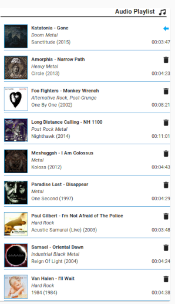
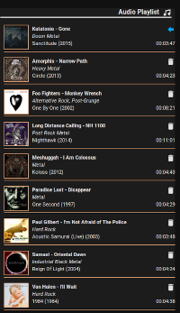
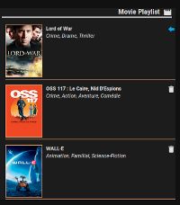

[![HACS Default][hacs_shield]][hacs]
[![Buy me a coffee][buy_me_a_coffee_shield]][buy_me_a_coffee]

[hacs_shield]: https://img.shields.io/static/v1.svg?label=HACS&message=Default&style=popout&color=green&labelColor=41bdf5&logo=HomeAssistantCommunityStore&logoColor=white
[hacs]: https://hacs.xyz/docs/default_repositories

[buy_me_a_coffee_shield]: https://img.shields.io/static/v1.svg?label=%20&message=Buy%20me%20a%20coffee&color=6f4e37&logo=buy%20me%20a%20coffee&logoColor=white
[buy_me_a_coffee]: https://www.buymeacoffee.com/jtbgroup


# Kodi-Playlist-Card

This card displays the playlist running on the kodi entity. The refresh is automatic based on events triggered by the entity.

This card is intented to be an alternative to an iframe containing Chorus.

| Audio Playlist | Audio Playlist | Video Playlist |
| ---- | ---- | ---- |
|  |  |  |

## Requirements

This card requires a specific sensor that gets the data from Kodi. The sensor is provided by the custom component [Kodi Media Sensors](https://github.com/jtbgroup/kodi-media-sensors). Keep this integration up to date to avoid strange behaviour of your card.

## Features

The card will let you track the playlist of kodi.
You can perform some actions directly from the card like removing an item from the playlist or play a specific entry in the playlist.

## Installation

1. Install the custom component [Kodi Media Sensors](https://github.com/jtbgroup/kodi-media-sensors).
2. Install the card using HACS

Manual installation is of course possible, but not explained here as there are plenty of tutorials.

## Card options

| Name | Type | Default | Since | Description |
|------|------|---------|-------|-------------|
| type | string | **required** | 1.0.0 | `custom:kodi-playlist-card` |
| entity | string | **required** | 1.0.0 |  `sensor.kodi_playlist` |
| title | string | optional | 1.0.0 | The title of the card |
| show_thumbnail | boolean | `false` | 1.1.2 | Set to true if you want to show the thumbnails coming from kodi. Attention you can get problems when mixing http and https content; if so, leave it to false. |
| show_thumbnail_overlay| boolean | `true` | 3.1 | When true, adds an lightgrey overlay above the thumbnail; this might be useful to see better the play icon displayed above the thumbnail. |
| show_thumbnail_border | boolean | `false` | 3.1 | When true, adds a 1px border around the thumbnails. |
| show_line_separator | boolean | `true` | 3.3 | When true, adds a 1 px border under each item of the playlist. |
| hide_last_line_separator | boolean | `false` | 4.0 | When true, the last line separator is hidden to avoid a last line (if show_line_separator is false). |
| outline_color | string | optional<br/>default: `white` | 3.1 | This option is to use in combination with other properties (**show_thumbnail_border** and **show_line_separator**). The color can be a string (ex: 'white', 'red', 'green', ... ), rgb format (ex: 'rgb(10, 12, 250)') or hexa format (ex: '#EE22FF'). |
| items_container_scrollable | boolean | `false` | 4.1 | Allows to add a scroll bar in order to enhance the navigation in case of long playlists |
| items_container_height | string | optional<br/>default: `300px` | 4.1 | Sets the height of the playlist when it's limited by the property `items_container_scrollable` |
| show_version | boolean | false | 4.4 | Shows the version of the card directly on the card. This is mainly useful for develpment purposes. |

**No need to pass the entity of the Kodi player as it is embedded in the data of the sensor.**

Example

``` yaml
    type: custom:kodi-playlist-card
    entity: sensor.kodi_media_sensor_playlist
    show_thumbnail: true
    show_thumbnail_border: true
    show_thumbnail_overlay: true
    show_line_separator: true
    outline_color: rgb(245,12,54)
``
