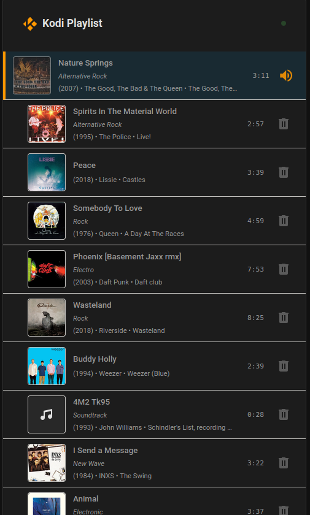

[![HACS Default][hacs_shield]][hacs]
[![Buy me a coffee][buy_me_a_coffee_shield]][buy_me_a_coffee]

[hacs_shield]: https://img.shields.io/static/v1.svg?label=HACS&message=Default&style=popout&color=green&labelColor=41bdf5&logo=HomeAssistantCommunityStore&logoColor=white
[hacs]: https://hacs.xyz/docs/default_repositories

[buy_me_a_coffee_shield]: https://img.shields.io/static/v1.svg?label=%20&message=Buy%20me%20a%20coffee&color=6f4e37&logo=buy%20me%20a%20coffee&logoColor=white
[buy_me_a_coffee]: https://www.buymeacoffee.com/jtbgroup


# Kodi Playlist Card

This Home Assistant Lovelace card displays the playlist provided by the [Kodi Media Sensors](https://github.com/jtbgroup/kodi-media-sensors) integration. The playlist updates automatically when the integration sends playlist events. The card is an alternative to displaying Kodi's Chorus interface in an iframe.

| Playlist |
| --- |
|  |

## Requirements

Install the [Kodi Media Sensors](https://github.com/jtbgroup/kodi-media-sensors) integration and configure its playlist sensor. The card uses that sensor's attributes to find the associated Kodi player; you do not need to configure the player entity separately.

## Features

- View the current Kodi playlist and identify the playing item.
- Play an item, remove an item, and drag items to reorder the playlist.
- Optionally show thumbnails, separators, and a scrollable playlist.
- Show the card version for troubleshooting.

## Installation

1. Install and configure the Kodi Media Sensors integration.
2. Install Kodi Playlist Card through HACS.
3. Add a `custom:kodi-playlist-card` card to a Lovelace dashboard and select the playlist sensor.

## Configuration

`Editor default` is the value initially supplied by the Home Assistant card editor. `When omitted` describes the card's runtime fallback for YAML configurations that leave the option out. These can differ for some options.

| Option | Type | Editor default | When omitted | Description |
| --- | --- | --- | --- | --- |
| `type` | string | Required | Required | Set to `custom:kodi-playlist-card`. |
| `entity` | string | Required | Required | Entity ID of the Kodi Media Sensors playlist sensor. |
| `title` | string | `Kodi Playlist` | `Kodi Playlist` | Card title. |
| `show_thumbnail` | boolean | `false` | `true` | Show item thumbnails. Thumbnail loading may be affected by mixed HTTP and HTTPS content. |
| `show_thumbnail_overlay` | boolean | `true` | `true` | Show an overlay on thumbnails to make the play icon easier to see. |
| `show_thumbnail_border` | boolean | `false` | `false` | Show a border around thumbnails. |
| `show_line_separator` | boolean | `true` | `false` | Show a separator below playlist items. |
| `hide_last_line_separator` | boolean | `false` | `false` | Hide the separator below the final item. Applies when `show_line_separator` is enabled. |
| `outline_color` | string or RGB array | `white` | Theme divider color | Color used for thumbnail borders and playlist separators. Supports CSS color strings; the editor provides a color selector. |
| `items_container_scrollable` | boolean | `false` | `false` | Limit the playlist height and allow vertical scrolling. |
| `visible_items_count` | number | Not set | `5` | Number of 60-pixel item slots used to calculate the scrollable container's maximum height. Only applies when `items_container_scrollable` is enabled. |
| `show_version` | boolean | `false` | `false` | Show the card version in the footer, mainly for troubleshooting. |

The editor suggests `sensor.kodi_playlist` as the entity. Select the actual playlist sensor created by your integration if its entity ID differs.

### Example

```yaml
type: custom:kodi-playlist-card
entity: sensor.kodi_media_sensor_playlist
show_thumbnail: true
show_thumbnail_border: true
show_thumbnail_overlay: true
show_line_separator: true
hide_last_line_separator: true
items_container_scrollable: true
visible_items_count: 5
outline_color: "rgb(245, 12, 54)"
```
